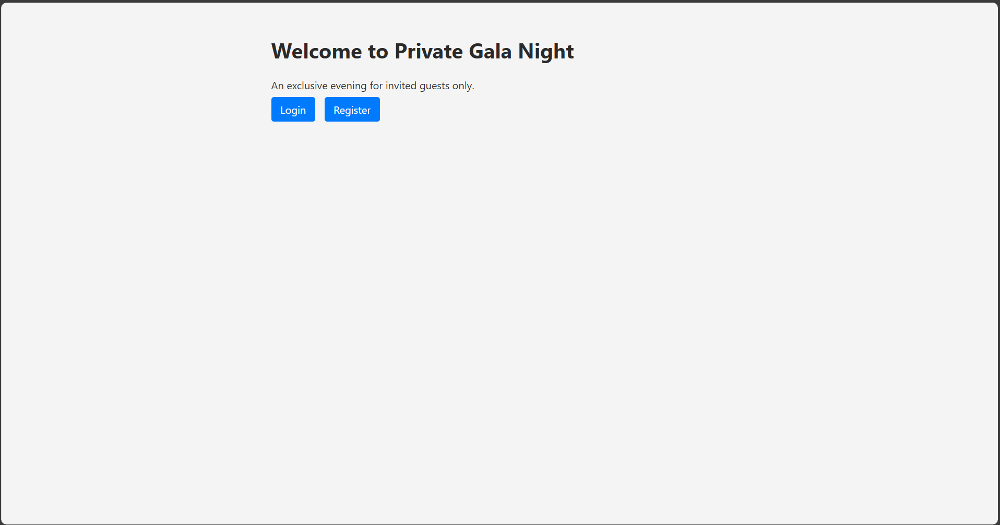
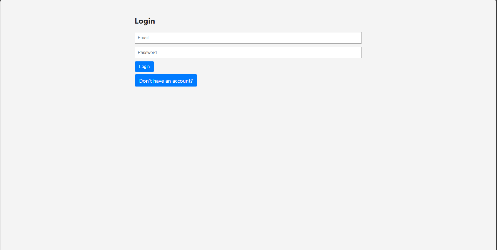
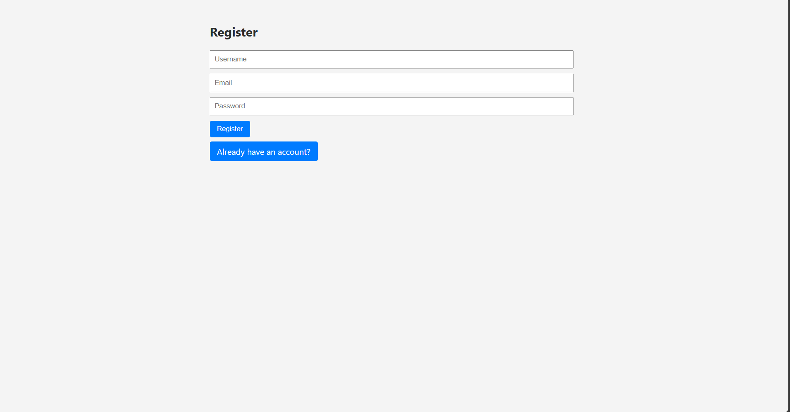

# RSVP Event App (Improved Version)

A full-featured RSVP system for a private event. Built with **Node.js**, **Express**, **EJS**, and **in-memory storage** (no database). Passwords are securely hashed using `bcrypt` and sessions are maintained using `express-session`.

## ✨ Features

- ✅ User registration with email, username, and password (with validation)
- 🔐 Login and logout with session persistence
- 💾 RSVP for a single private event
- 👑 Admin sees full RSVP list with timestamps
- 🛡 Passwords hashed with `bcrypt`
- 🎨 Styled UI with clean layout using CSS
- ⚠ Proper error handling (invalid credentials, duplicate emails, short passwords, etc.)

## 🛠 Technologies Used

- Node.js
- Express.js
- EJS templating
- express-session
- bcrypt
- In-memory storage (arrays)

## 🖥 Pages

- **Home Page** – Welcome and login/register
- **Register Page** – Create a new account
- **Login Page** – Login with email and password
- **Event Page** – See event details and RSVP
- **Admin View** – Admins see all RSVP'd users

## 🚀 Getting Started

1. Clone the repository:
```bash
git clone <your-repo-url>
cd rsvp-event-app-improved
```

2. Install dependencies:
```bash
npm install
```

3. Start the server:
```bash
npm start
```

4. Open in browser:
```
http://localhost:3000
```

## 👥 Admin Access

- The **first user to register** becomes the admin automatically.
- Admins can see the full list of RSVP'd users and their timestamps.

## 📂 Project Structure

```
.
├── app.js
├── package.json
├── public/
│   └── style.css
├── views/
│   ├── home.ejs
│   ├── login.ejs
│   ├── register.ejs
│   ├── event.ejs
│   └── partials/
│       └── header.ejs
```

## 📸 Screenshots

1) 

2) 

3) 

4) 

5) 
## 📄 License

MIT License (or as per assignment policy)
